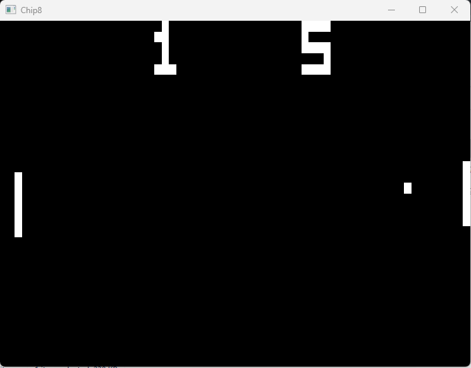
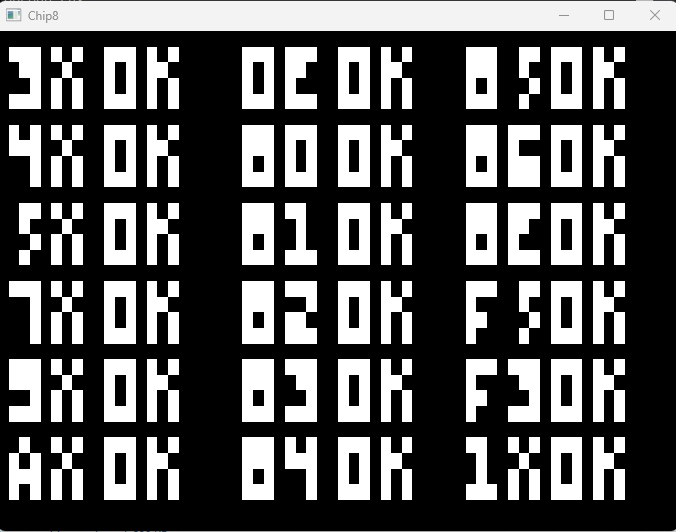

# Chip8 



This project is a `Chip8 Emulator` written in C++17 using SDL2 for Windows.

### Prerequisites
* SDL2
* Premake
* C++
* Visual Studio


### Building

Building the emulator requires Visual Studio2022 and SDL2 and This has only been tested on Windows. To compile the project, run the build.bat in scripts :

```
cd scripts
build.bat //Creates a Chip8.sln file
```

Open Chip8.sln and build


## Usage

```
usage: Chip8.exe <rom_file>
```


<!-- ROADMAP -->
## Tests
This emulator was tested using corax89's test_opcode.ch8




<!-- LICENSE -->
## License

Distributed under the MIT License. See `LICENSE.txt` for more information.


<!-- ACKNOWLEDGMENTS -->
## Acknowledgments

* [Chip8 Wikipedia](https://en.wikipedia.org/wiki/CHIP-8)
* [Codeslinger Chip8](http://www.codeslinger.co.uk/pages/projects/chip8.html)
